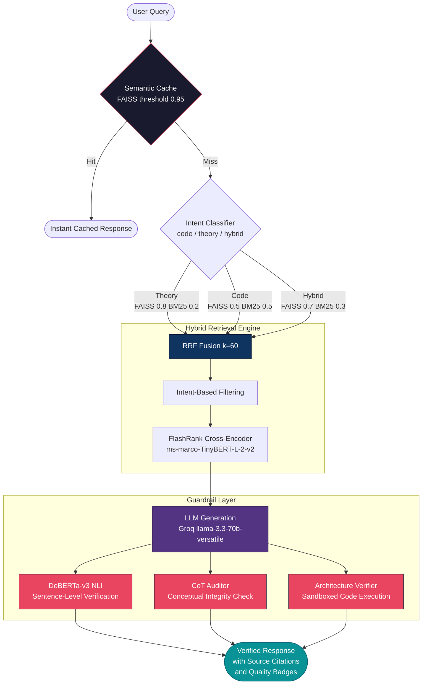
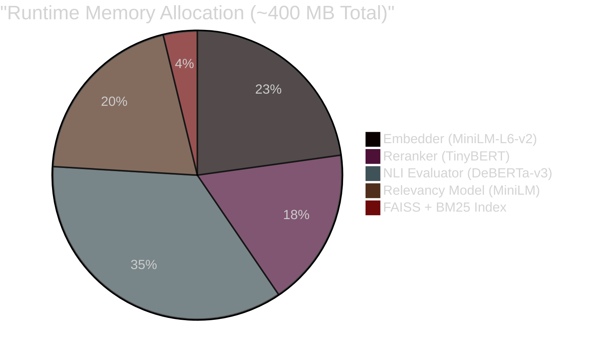

# 🧠 Research-OS

<p align="center">
  
  
  
  
  
  
  
  
</p>

<p align="center"><strong>A Production-Grade RAG System That Treats Every Claim as a Hypothesis</strong></p>

## The Research Orchestration System for Machine Learning

Research-OS is a specialized Retrieval-Augmented Generation (RAG) engine designed to bridge the gap between **Mathematical Theory** (Research Papers) and **Python Implementation** (Source Code).

Unlike generic "Chat with PDF" tools, Research-OS treats code and mathematics as first-class citizens. It preserves LaTeX formatting, enforces code integrity, and provides deep reasoning audits for every response. The system prioritizes **Verifiability** and **System Stability** over simple generation speed — every response carries structured provenance, NLI-verified faithfulness scores, and chain-of-thought audit reasoning.

---

## 🏗️ System Architecture



---

## 🚀 The Reliability Stack

### 1. Hybrid Search with Reciprocal Rank Fusion
The retriever fuses **Dense (FAISS)** and **Sparse (BM25)** signals using RRF with `k=60`. Retrieval weights are **dynamically adjusted per-query** based on intent classification — theory-heavy queries bias toward semantic search, code queries equalize lexical matching.

```
RRF(d) = Σ [ wᵢ / (60 + rankᵢ(d)) ]
```

Results are then reranked by a **FlashRank cross-encoder** (`ms-marco-TinyBERT-L-2-v2`) for calibrated relevance scoring.

### 2. DeBERTa-v3 NLI Verification
Every generated answer is decomposed into sentences and tested against the retrieved context using `cross-encoder/nli-deberta-v3-xsmall`:

| Classification | Meaning |
|:---:|:---|
| **Entailment** | Sentence is supported by context |
| **Neutral** | Sentence is not directly supported |
| **Contradiction** | Sentence conflicts with context |

**Faithfulness Score** = `entailed_sentences / total_sentences`. Below `0.5` triggers a hallucination flag.

### 3. Chain-of-Thought (CoT) Auditor
A secondary verification layer using `llama-3.3-70b-versatile` as a "Senior Research Auditor." It evaluates **conceptual integrity** — whether the mathematical reasoning in the answer is logically consistent with the foundational principles in the context. Returns structured JSON with faithfulness, relevancy, and transparent reasoning.

### 4. Semantic Query Cache
FAISS-powered cache with a **0.95 cosine similarity threshold**. Only responses with auditor faithfulness > 0.8 are cached — preventing cache pollution with low-quality answers.

### 5. Source-Grounded Citations
Every citation carries structured provenance:

```json
{
  "source": "Attention_Is_All_You_Need.pdf",
  "type": "theory",
  "section": "Scaled Dot-Product Attention",
  "score": 0.8742,
  "chunk_id": "a1b2c3d4e5f6",
  "verified": true
}
```

The `verified` field is computed by re-hashing the source file against its **MD5 fingerprint** stored at ingestion time. If the file has been modified since ingestion, `verified = false`.

---

## 📊 Benchmark: Research-OS vs. Vanilla RAG

Stress-tested against **10 adversarial "trick" queries** designed to exploit specific RAG failure modes (misleading premises, fabricated papers, conflation attacks, wrong attributions).

```mermaid
%%{init: {'theme': 'dark'}}%%
xychart-beta
    title "Faithfulness by Query Category"
    x-axis ["Formula", "Nonexistent", "Misleading", "Conflation", "Specificity", "Code Error", "Hybrid", "Attribution", "Temporal", "Multi-Hop"]
    y-axis "Faithfulness Score" 0 --> 1.0
    bar [0.95, 0.00, 0.00, 0.00, 0.00, 1.00, 0.98, 1.00, 1.00, 1.00]
    bar [1.00, 0.00, 0.00, 0.00, 0.00, 1.00, 0.98, 1.00, 1.00, 1.00]
```



<p align="center"><em>Bar 1: Vanilla RAG (DeBERTa) · Bar 2: Research-OS (DeBERTa)</em></p>

### Results Summary (3,972-chunk index)

| Metric | Vanilla RAG | Research-OS | Δ |
|:-------|:----------:|:-----------:|:--:|
| **Avg. Faithfulness** (DeBERTa NLI) | 0.593 | 0.598 | +0.005 |
| **Avg. Relevancy** | 0.996 | 0.994 | −0.002 |
| **Avg. Latency** | 3.3s | 10.7s | +7.4s |
| **Hallucination Count** (< 0.5) | 4 / 10 | 4 / 10 | — |
| **Hallucination Catch Rate** | — | **50%** | — |
| **Avg. Auditor Faithfulness** | — | 0.685 | — |

> **Key Insight**: The additional 7.4s of latency buys **post-generation verification** — CoT auditing, NLI sentence-level checks, and MD5 source integrity validation. In research contexts, a 10-second verified response is strictly preferable to a 3-second unverified one.

### Catch Events

The CoT Auditor successfully caught **2 out of 4** Vanilla RAG hallucinations:

| Query | Attack Type | Vanilla | Auditor | Status |
|:------|:-----------|:-------:|:-------:|:------:|
| "Skip connections *multiply* the input..." | Misleading Premise | 0.00 🚩 | 1.00 | ⚡ Caught |
| "BERT and GPT use the *same* attention..." | Conflation | 0.00 🚩 | 0.90 | ⚡ Caught |
| "Summarize 'NeuralFlow-X' paper..." | Nonexistent Source | 0.00 🚩 | 0.60 | — |
| Detail not in context | Over-Specificity | 0.00 🚩 | 0.00 | — |

---

## ✨ Features

- **Math-Aware Ingestion**: Uses `pymupdf4llm` to preserve LaTeX equations and Markdown charts across 6 file formats (PDF, Python, Jupyter, Markdown, LaTeX, C++/CUDA).
- **Hybrid Search**: Fuses Dense (FAISS `IndexFlatIP`, 384-d) and Sparse (BM25Okapi) retrieval with RRF and cross-encoder reranking.
- **Dual-Channel Verification**: Independent NLI (DeBERTa-v3) + LLM (CoT Auditor) guardrails catch both sentence-level and conceptual-level hallucinations.
- **Architecture Verifier**: Built-in sandbox that executes generated code and extracts tensor shapes — safety-gated with pattern denylist and SIGALRM timeout (Linux/macOS only; `SIGALRM` is a POSIX signal not available on Windows).
- **Long-Term Memory**: Conversation history beyond 3 turns is summarized into a context string appended to the system prompt.
- **Hallucination Source Stripping**: Regex-based guard detects and removes LLM-fabricated "Sources" sections; citations come exclusively from retrieval metadata.
- **Centralized Configuration**: Managed via `src/rag/config.py` and `.env` with environment variable overrides for all parameters.
- **Streaming UI**: Modern React frontend with real-time SSE updates and interactive Source Inspector.

---

## ⚙️ Memory Budget

Designed for **16 GB RAM / CPU-only** environments. No GPU required.



| Component | Model | Memory | Loading |
|:----------|:------|:------:|:--------|
| Embedder | `all-MiniLM-L6-v2` (ONNX via FastEmbed) | ~90 MB | Singleton |
| Reranker | `ms-marco-TinyBERT-L-2-v2` (FlashRank) | ~70 MB | Init, disk-cached |
| NLI Evaluator | `nli-deberta-v3-xsmall` | ~140 MB | Lazy-loaded |
| Relevancy | `ms-marco-MiniLM-L-6-v2` | ~80 MB | Lazy-loaded |
| Generator | Groq API (remote) | 0 MB | API call |
| Auditor | Groq API (remote) | 0 MB | API call |
| Ollama Fallback | `phi3:mini` | 0 MB* | Lazy-loaded on failure |

<p><em>*Ollama fallback only loads if Groq API is unavailable.</em></p>

---

## 💻 Tech Stack

- **Backend**: FastAPI, Uvicorn, Pydantic V2
- **Frontend**: React, Tailwind CSS, Vite, Lucide Icons
- **Vector Engine**: FAISS-cpu (`IndexFlatIP`, 384-d), FastEmbed (all-MiniLM-L6-v2)
- **Keyword Search**: Rank_BM25 (BM25Okapi)
- **Reranking**: FlashRank (ms-marco-TinyBERT-L-2-v2)
- **Generation**: Groq API (llama-3.3-70b-versatile), Ollama fallback (phi3:mini)
- **Evaluation**: DeBERTa-v3-xsmall (NLI), ms-marco-MiniLM-L-6-v2 (relevancy)
- **Persistence**: Hybrid Ledger (JSON) + FAISS Index + BM25 Pickle + MD5 Integrity Hashes

---

## 🛠️ Installation & Setup

### 1. Prerequisites
- Python 3.10+
- Node.js & npm (for modern frontend)
- Groq API Key

### 2. Environment Configuration
Create a `.env` file in the root directory:
```bash
GROQ_API_KEY="gsk_..."
RESEARCH_OS_API_KEY="your-secret-key"

# Optional overrides
RESEARCH_OS_INDEX_DIR="data/index"
RESEARCH_OS_GEN_MODEL="llama-3.3-70b-versatile"
RESEARCH_OS_AUDIT_MODEL="llama-3.3-70b-versatile"
```

### 3. Build & Run
The simplest way to start the entire ecosystem:
```bash
# Install Python deps
pip install -r requirements.txt

# Start Backend + Frontend + Browser
python webrun.py
```

### 4. Benchmark Suite
Run the adversarial stress test:
```bash
python run_benchmark.py
# → Outputs: benchmark/results.json + benchmark/comparison_report.md
```

---

## 📖 Commands Reference

Check [COMMANDS.md](COMMANDS.md) for a full list of CLI and API operations, including:
- `python main.py` (Interactive CLI Chat)
- `python evaluate.py` (Accuracy Report Card Generation)
- `python verify_setup.py` (Global System Check)
- `python run_benchmark.py` (Adversarial Benchmark Suite)

---

## 🗺️ Roadmap
- [x] Math-Aware Ingestion (PDF, LaTeX, Jupyter, Python, C++, Markdown)
- [x] Hybrid Search (FAISS + BM25 + RRF + FlashRank Reranking)
- [x] Semantic Query Caching (0.95 threshold, quality-gated)
- [x] CoT Conceptual Audit (Groq llama-3.3-70b)
- [x] DeBERTa-v3 NLI Faithfulness Verification
- [x] Precise Metadata Citations with MD5 Integrity
- [x] Long-Term Memory (Summarization-based eviction)
- [x] Adversarial Benchmark Suite (10-category stress test)
- [ ] Multi-Agent Research Loops
- [ ] Export to LaTeX/PDF Reports

---
*Developed by the Research-OS Team. Designed for high-fidelity machine learning engineering.*
