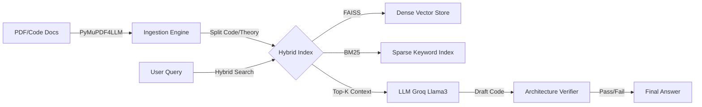

# 🧠 Research-OS

<p align="center">


</p>

## The Research Orchestration System for Machine Learning

**Python**  
**License**  
**Status**  
**Backend**

---

Research-OS is a specialized Retrieval-Augmented Generation (RAG) engine designed to bridge the gap between Mathematical Theory (Research Papers) and Python Implementation (Source Code).

Unlike generic "Chat with PDF" tools, Research-OS treats code and mathematics as distinct data types. It preserves LaTeX formatting, enforces code integrity, and verifies generated architectures against runtime errors.

---

## 🚀 The Problem

Machine Learning research involves two distinct languages:

**The Abstract:** Mathematical notation found in ArXiv papers (e.g.,  
Attention(Q,K,V)).  

**The Concrete:** Executable code found in documentation (e.g., torch.nn.MultiheadAttention).  

Standard RAG systems fail here because they treat everything as plain text. They strip LaTeX, break code indentation, and hallucinate tensor dimensions.

---

## 🛠️ The Solution

Research-OS acts as a "Research Architect." It ingests papers and codebooks, indexes them separately using Hybrid Search, and uses a multi-step verification pipeline to ensure the code it writes actually matches the math it reads.

---

## ✨ Key Features

### 1. Math-Aware Ingestion Pipeline
Uses pymupdf4llm to extract text while preserving LaTeX equations, Headers, and Markdown tables.  
Semantic Segmentation: Automatically detects and separates "Theory Chunks" (text/math) from "Code Chunks" (Python implementations) during indexing.

### 2. Hybrid Search Architecture
Combines Dense Retrieval (FAISS) for semantic understanding ("How does Diffusion work?") with Sparse Retrieval (BM25) for keyword precision ("Show me the forward() function").  
Ensures that queries retrieve both the conceptual explanation and the exact code snippet.

### 3. The "Sanity Check" Verifier
A built-in Code Sandbox that executes generated PyTorch code in a controlled environment.  
Tensor Shape Verification: Detects dimension mismatches (e.g., passing a 3D tensor to a 2D layer) and auto-corrects or warns the user before displaying the code.

### 4. Incremental Indexing
Features a state-tracking ledger that logs processed files.  
Adding 1 new paper to a database of 1,000 takes seconds, not hours.

### 5. Local-First, Cloud-Accelerated
Privacy: All documents and Vector Indices are stored locally.  
Performance: Uses Groq API (Llama-3-70B) for sub-second inference, bypassing local hardware bottlenecks (16GB RAM limit).

---

## 🏗️ Architecture



---

## 💻 Installation

### Prerequisites
- Ubuntu / Linux (Recommended)  
- Python 3.10+  
- Groq API Key (Free tier available)  

---

### Setup

#### Clone the Repository
```bash
git clone https://github.com/sharansh-22/Research-OS.git
cd Research-OS
```

#### Create Environment
```bash
conda create -n research-os python=3.10
conda activate research-os
```

#### Install Dependencies
```bash
pip install -r requirements.txt
```

#### Configure Environment
Create a .env file (or export in terminal) with your API key:

```bash
export GROQ_API_KEY="gsk_your_key_here"
```

---

## 📖 Usage

### 1. Build the Knowledge Base (The Builder)
Download your papers/books into the data/ directory and run the ingestion script. This runs locally on your CPU.

```bash
python scripts/ingest_batch.py
```

**Note:** Thanks to incremental indexing, this only processes new files on subsequent runs.

---

### 2. Chat with the Architect (The Player)
Start the CLI assistant.

```bash
python main.py
```

**Example Query:**

"Explain the difference between Batch Norm and Layer Norm mathematically, and provide a PyTorch implementation for Layer Norm."

---

## 🧰 Tech Stack

- **Ingestion:** pymupdf4llm (PDF to Markdown)  
- **Embeddings:** fastembed (CPU-optimized, Nomic-Embed)  
- **Vector DB:** faiss-cpu (Dense Search)  
- **Keyword Search:** rank_bm25 (Sparse Search)  
- **LLM Inference:** Groq API (Llama-3-70B)  
- **Orchestration:** Custom Python Pipeline (No LangChain bloat)  

---

## 🗺️ Roadmap

- Math-Aware Ingestion  
- Hybrid Search (FAISS + BM25)  
- Runtime Code Verification  
- FastAPI Backend: Expose RAG pipeline via REST endpoints.  
- Streamlit UI: Dual-pane interface (Chat on left, Source PDF view on right).  
- Ragas Evaluation: Automated benchmarking of retrieval precision.
