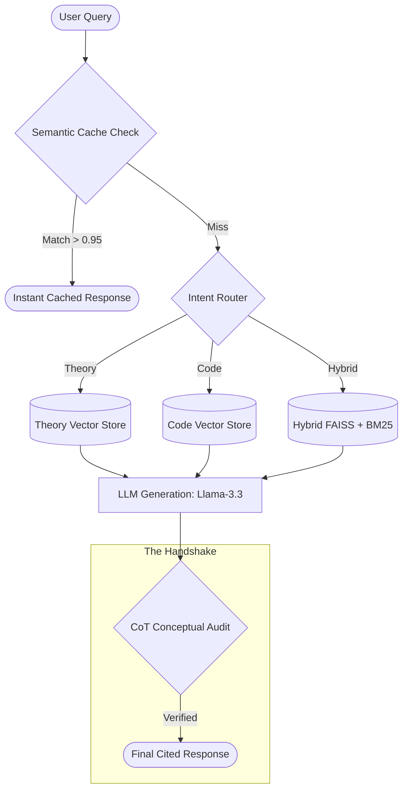

# 🧠 Research-OS

<p align="center">
  
  
  
  
  
</p>

## The Research Orchestration System for Machine Learning

Research-OS is a specialized Retrieval-Augmented Generation (RAG) engine designed to bridge the gap between **Mathematical Theory** (Research Papers) and **Python Implementation** (Source Code). 

Unlike generic "Chat with PDF" tools, Research-OS treats code and mathematics as first-class citizens. It preserves LaTeX formatting, enforces code integrity, and provides deep reasoning audits for every response.

---

## 🚀 The Core Upgrades

### 1. Semantic Query Caching
Optimized for performance and cost. The system uses a **FAISS-powered Semantic Cache** with a **0.95 similarity threshold**. If a similar query has been asked before, the system retrieves the response instantly, bypassing the LLM generation step while maintaining accuracy.

### 2. Conceptual / CoT Auditor
Every response undergoes a rigorous **Chain-of-Thought (CoT) Audit** using `llama-3.3-70b-versatile`. This "Senior Research Auditor" layer verifies that the AI's logic aligns perfectly with the retrieved mathematical theory, providing a transparent "Reasoning" string for the user.

### 3. Source-Grounded Citations
No more "black box" answers. Our **Citation Engine** maps every evidence chunk to its specific source.
- **File Name Mapping**: Identifies the exact document (e.g., `Attention_Is_All_You_Need.pdf`).
- **Page-Level Precision**: Points to the exact page where the theory or code snippet resides.

---

## 🏗️ How It Works (System Flow)



---

## ✨ Features

- **Math-Aware Ingestion**: Uses `pymupdf4llm` to preserve LaTeX equations and Markdown charts.
- **Hybrid Search**: Fuses Dense (FAISS) and Sparse (BM25) retrieval for maximum recall.
- **Architecture Verifier**: A built-in sandbox that executes and verifies tensor shapes in generated code.
- **Centralized Configuration**: Managed via `src/rag/config.py` and `.env` for production-ready deployments.
- **Streaming UI**: Modern React frontend with real-time SSE updates and interactive Source Inspector.

---

## 💻 Tech Stack

- **Backend**: FastAPI, Uvicorn, Pydantic V2
- **Frontend**: React, Tailwind CSS, Vite, Lucide Icons
- **Vector Engine**: FAISS-cpu, FastEmbed (Nomic)
- **Keyword Search**: Rank_BM25
- **LLM Context**: Groq API (Llama-3.3-70B)
- **Persistence**: Hybrid Ledger (JSON) + Vector Index

---

## 🛠️ Installation & Setup

### 1. Prerequisites
- Python 3.10+
- Node.js & npm (for modern frontend)
- Groq API Key

### 2. Environment Configuration
Create a `.env` file in the root directory:
```bash
GROQ_API_KEY="gsk_..."
RESEARCH_OS_API_KEY="your-secret-key"
```

### 3. Build & Run
The simplest way to start the entire ecosystem:
```bash
# Install Python deps
pip install -r requirements.txt

# Start Backend + Frontend + Browser
python webrun.py
```

---

## 📖 Commands Reference

Check [COMMANDS.md]for a full list of CLI and API operations, including:
- `python main.py` (Interactive CLI Chat)
- `python evaluate.py` (Accuracy Report Card Generation)
- `python verify_setup.py` (Global System Check)

---

## 🗺️ Roadmap
- [x] Math-Aware Ingestion
- [x] Semantic Query Caching
- [x] CoT Conceptual Audit
- [x] Precise Metadata Citations
- [ ] Multi-Agent Research Loops
- [ ] Export to LaTeX/PDF Reports

---
*Developed by the Research-OS Team. Designed for high-fidelity machine learning engineering.*
